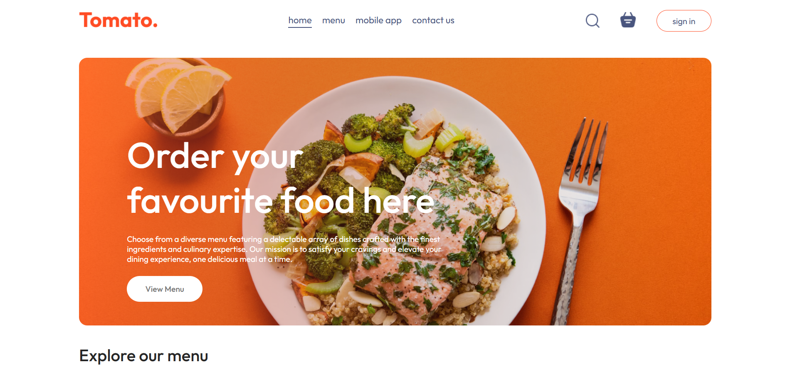
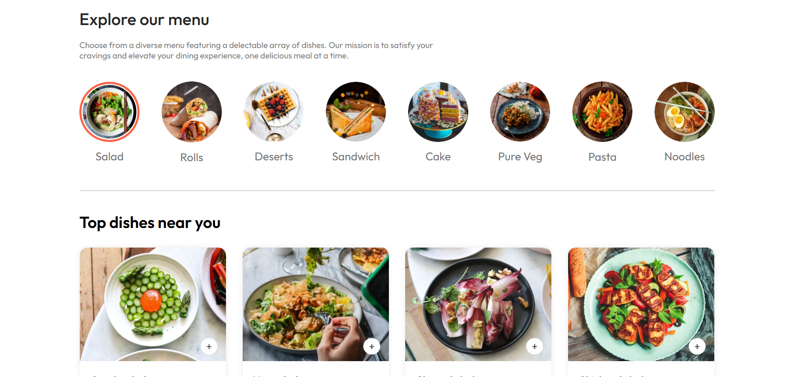
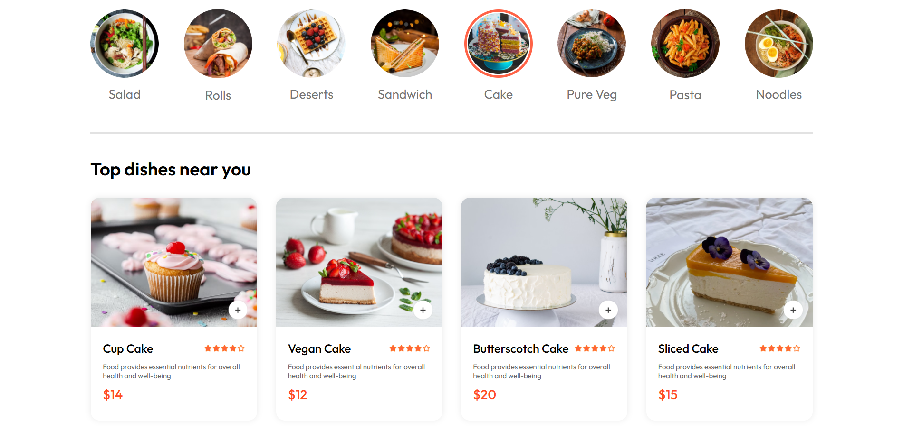
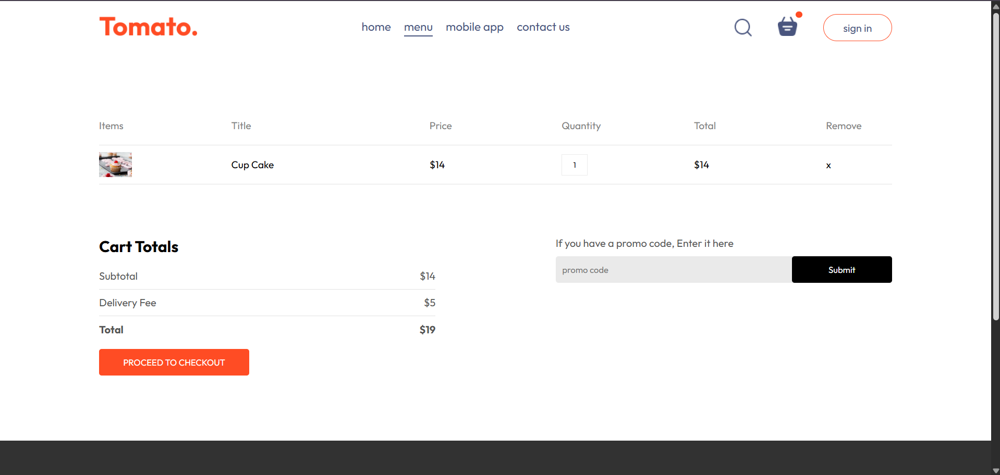

# 🍅 Tomato – Food Ordering Web Application

Tomato is a modern frontend food ordering web application that allows users to browse food items, view menus, and experience a smooth and responsive UI. The project focuses on clean design, fast performance, and scalable frontend architecture using React and Vite.
---

## 🚀 Features

### 🍔 Food Browsing
- Browse different food items
- Clean and user-friendly layout
- Category-based food display

### 🛒 Cart & UI Flow
- Add/remove items (UI level)
- Dynamic cart updates
- Smooth navigation experience

### 🎨 Modern UI
- Responsive design
- Clean component-based structure
- Optimized for fast loading

### ⚡ Performance
- Built with Vite for fast builds
- Efficient React rendering
- Optimized assets
---

## 🛠️ Tech Stack

### **Frontend**
- React
- Vite
- Axios
- Clerk Authentication
- Vercel Deployment

### **Backend**
- Node.js
- Express
- MongoDB / Mongoose
- Cloudinary
- Render Deployment

---

## 🌐 Deployment Links

- Live deployment link: https://tomato-psi-rosy.vercel.app/

---

## 🔧 Installation

### 1️⃣ Clone the repository
git clone https://github.com/Ridhi247/Tomato
cd Tomato

### 2️⃣ Install frontend dependencies
cd client
npm install

### 3️⃣ Install backend dependencies
cd ../server
npm install

---

## ▶️ Run Locally

## Backend
cd server
npm start

## Frontend
cd client
npm run dev

---

## 🧠 Challenges Faced
- Integrating Clerk authentication with backend
- Setting up environment variables on Vercel and Render
- Solving CORS issues between frontend and backend
- Handling Cloudinary multi-image uploads
- Fixing GitHub and Vercel deployment configuration issues

---

## 📚 Learnings

- Full-stack deployment workflow
- Token-based authentication
- Cloudinary image handling
- Environment variable security
- Debugging real API issues

---

## 🤝 Contributing
Contributions and suggestions are welcome.

---

## 📸 Screenshots

### 🍅 Home Page

### 🏨 Food Menu / Listings

### 🧾 Food Details Page

### 🛒 Cart / Order Section

